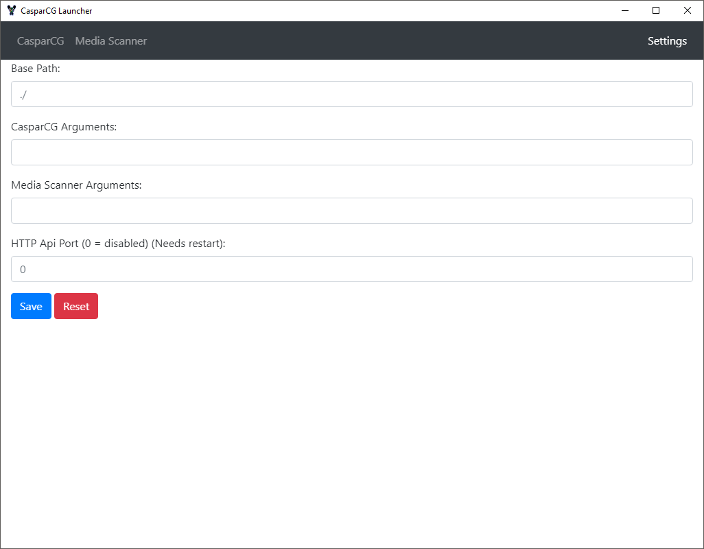

# Sofie CasparCG Server Launcher
This is the _CasparCG Server Launcher_ application, part of the [**Sofie** TV Automation System](https://github.com/nrkno/Sofie-TV-automation/). 

## Repository-specific Info for Developers
* [Developer Info](DEVELOPER.md)
* [Contribution Guidelines](CONTRIBUTING.md)

## General Sofie System Info
* [Documentation](https://nrkno.github.io/sofie-core/)
* [Releases](https://nrkno.github.io/sofie-core/releases)

---
## Features
 * Presents log in a more readable format with lines coloured by severity
 * Builds as a single exe that can be dropped into existing casparcg folder
 * Allows for easy stopping and restarting of both casparcg and media-scanner
 * Allows for running other processes (eg custom clients)
 * Option to pass through command line options to each executable
 * Auto restart each process upon crashing or exiting
 * Basic http api to stop/start/restart each process remotely
 * Serve folders over http (eg templates, media)
 * Status page to see an overview of process status

 See the [changelog](CHANGELOG.md) for more information


## Screenshots




## Build Setup

``` bash
# install dependencies
yarn

# serve with hot reload at localhost:9080
yarn run dev

# build electron application for production
yarn run build

# lint all JS/Vue component files in `src/`
yarn run lint

```

This project was generated with [electron-vue](https://github.com/SimulatedGREG/electron-vue)@[7c4e3e9](https://github.com/SimulatedGREG/electron-vue/tree/7c4e3e90a772bd4c27d2dd4790f61f09bae0fcef) using [vue-cli](https://github.com/vuejs/vue-cli). Documentation about the original structure can be found [here](https://simulatedgreg.gitbooks.io/electron-vue/content/index.html).

---

_The NRK logo is a registered trademark of Norsk rikskringkasting AS. The license does not grant any right to use, in any way, any trademarks, service marks or logos of Norsk rikskringkasting AS._

